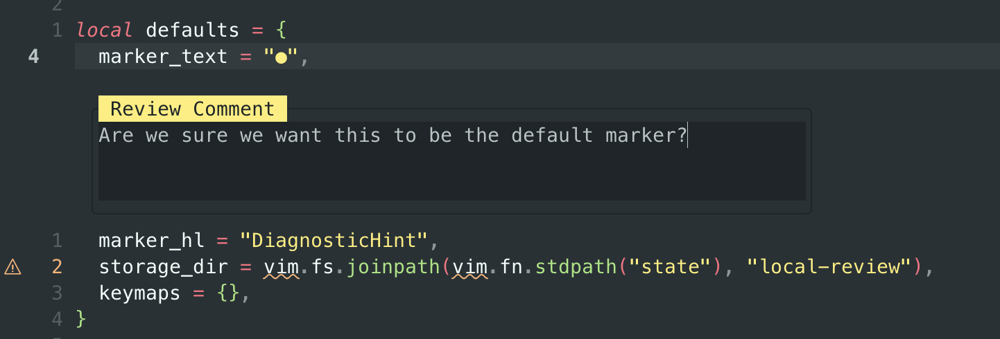
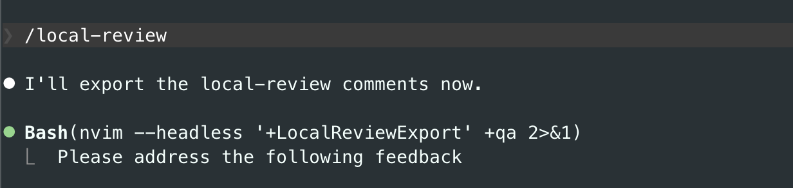

# local-review.nvim

Neovim plugin for local code review, built for use with coding agents.

## Features

<details>
  <summary>Demo video</summary>

  [Video Demo](https://github.com/user-attachments/assets/7c2d1fa2-9d4d-4660-bd1d-c044b9a86279)

</details>


Add, edit and delete comments on lines of code. Use your existing diff-viewer for diffs.



Use the included [skill](./skills/local-review/SKILL.md) that tells agents how to read comments.



## Installation

Use your preferred plugin manager. Example with `lazy.nvim`:

```lua
{
  "ssundarraj/local-review.nvim",
  config = function()
    require("local_review").setup({
      marker_text = "●",
      marker_hl = "DiagnosticHint",
      keymaps = {
        comment = "<leader>rc",
        delete = "<leader>rd",
        next = "]r",
        prev = "[r",
        export = "<leader>re",
      },
      comment_close_keys = {
        { modes = { "n" }, key = "q" },
        { modes = { "n", "i" }, key = "<C-c>" },
      },
    })
  end,
}
```

Copy or symlink the skill into your preferred harness's skills directory.

### Telescope

If you use Telescope, you can open a picker for all review comments in the current repo:

```lua
vim.keymap.set("n", "<leader>lr", function()
  require("local_review.telescope").comments()
end, { desc = "Local Review Picker" })
```

## Commands

- `:LocalReviewComment` open the comment editor for the current line
- `:LocalReviewDelete` delete the comment on the current line
- `:LocalReviewNext` jump to the next review comment in the current file
- `:LocalReviewPrev` jump to the previous review comment in the current file
- `:LocalReviewExport [path]` print review comments for a path in a copy/paste-friendly format. If path is omitted, it uses the current repo root when available, otherwise `cwd`.
- `:LocalReviewClear [path]` delete stored review comments for a path. If path is omitted, it uses the current repo root when available, otherwise `cwd`.

## Notes

- The inline comment editor closes with `q` in normal mode and `<C-c>` in normal or insert mode by default. Configure those bindings through `comment_close_keys`, or remove entries to disable them.
- Comments are stored by scope root: repo root when inside git, otherwise the file's parent directory.
- Export and clear can target either a file or a directory.
- This was largely vibe-coded. There is likely some poor code and you may find bugs.
- Issues/PRs welcome but please open an issue before making a large change.
